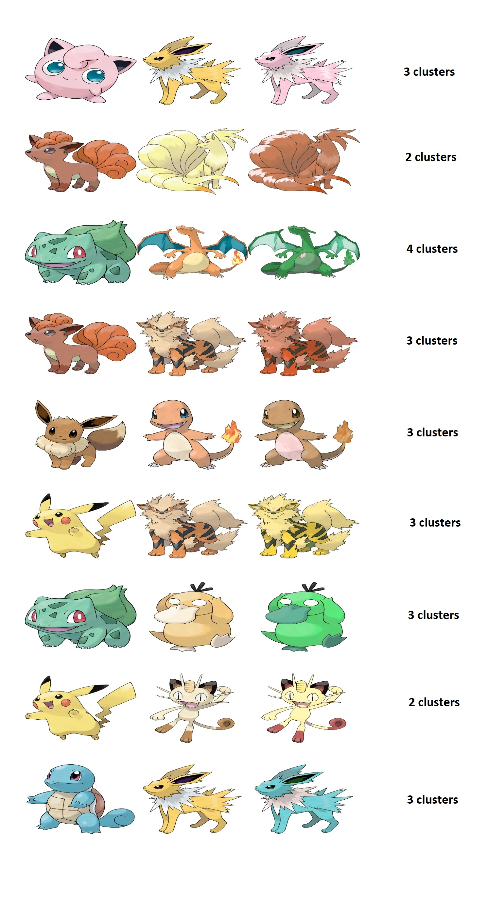

# Shift-colours-in-images

This project is intended to grab a number of dominant colours from the source image and transfer them to the corresponding dominant colour regions in the target image.

Note: The images must be closed-border object-type to get desirable results.

## Steps involved

1. User inputs the source and target images. User also inputs the number of clusters (n).
2. Using K-Means clustering algorithm, pixels are segregated into n dominant clusters of colours.
3. Clusters are ordered in descending order of popularity.
4. A colour-map is designed to organise colours and their pixel locations.
5. Colours are shifted from source to target image based on the colour-map created.
6. Get the new results.

Here, all operations are performed in HSV colour space, as it maintains the shades of colours in the images.

## Results

I tried this code on different varieties of Pokemon! For each of the pairs, I tried colour-shifting for different values of 'n' - results vary depending on number of different colours in both images - the values yielding the best results are specified below.

## Reference
[colour-shift by Maya Murad](https://github.com/mayaserena/colour-shift)